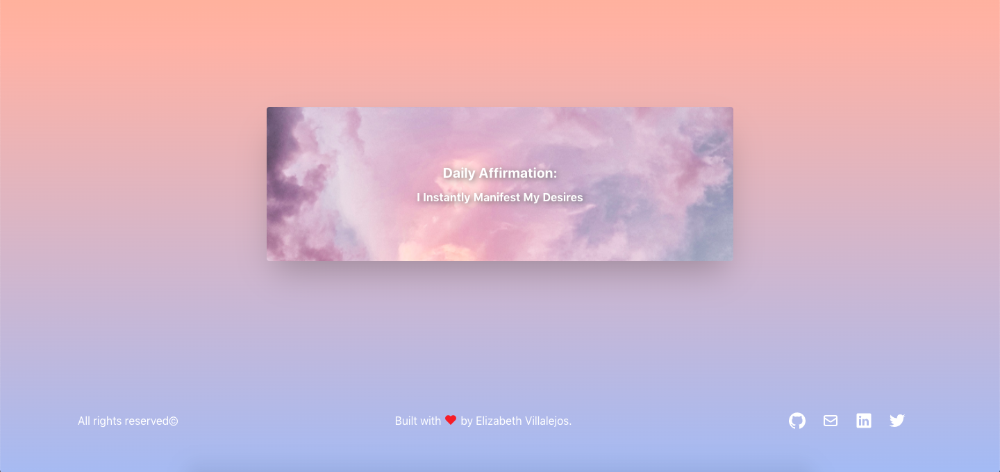

# 💻 Woof Affirmations (BETA)

The word affirmation comes from the Latin affirmare, originally meaning "to make steady, strengthen." 
Affirmations are proven methods of self-improvement because of their ability to rewire our brains. 
[More info here](https://www.huffpost.com/entry/affirmations_b_3527028)  
To help out, Dulce gives you a daily affirmation. 
Front-end for [Dulce Namaste](https://dulce-namaste.netlify.app/) 
Built with React and TypeScript. 
Powered by coffee:coffee: and barks :dog:.

## 🔨 Tools

- TypeScript
- Node
- Express

## ✨ Live Demo

You can get an affirmation [here.](https://dulce-affirmations-api-39977e6214e6.herokuapp.com/api/affirmation)

## Author

👤 Elizabeth Villalejos

- [Github](https://github.com/misselliev)
- [Linkedin](https://linkedin.com/elivillalejos)
- [Dev.to](https://dev.to/misselliev)
- [Email](mailto:elizabeth.villalejos@gmail.com?subject=Website%20Inquiry)

## 🤝 Contributing

Contributions, issues and feature requests are welcome!

Feel free to check the [issues page](issues/).

## Show your support

Give a ⭐️ if you like this project!

> “What simple action could you take today to produce a new momentum toward success in your life?” Tony Robbins
